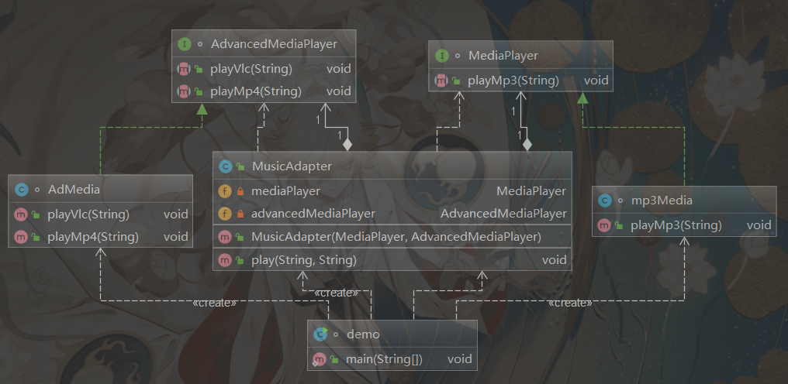

# 设计模式编程题

**出题方式，画出该设计模式解决问题所用方案使用的类图，写出各个类的简要代码**

## 创建型设计模式

### **单例模式**

UML类图：

饿汉式：


懒汉式：


代码：

```java
package com.cc.design.singleton;

/**
 * @author CC
 * @date 2023/5/20
 */

public class Singleton {
    //饿汉式  太饿了，直接实例化instance
    private static Singleton singleton =new Singleton();
    private Singleton(){

    }
    public static Singleton getInstance(){
        return singleton;
    }
}

class Instance{
    //懒汉式 在声明的时候不赋值  比较懒
    private volatile static Instance instance;
    private Instance(){
    }
    public static Instance getInstance(){
        //单线程下没问题，多线程——>双重检查锁
        if(instance==null){
            synchronized (Instance.class){
                if(instance==null){
                    instance=new Instance();
                    //不是原子化操作：可能发生指令重排序
                    // 1.singleton分配内存空间;
                    // 2.初始化singleton;
                    // 3.将singleton指向分配的内存空间。
                }
            }
        }
        return instance;
    }
}

class demo{
    public static void main(String[] args) {
        Singleton s1 = Singleton.getInstance();
        Singleton s2 = Singleton.getInstance();
        System.out.println(s1==s2);

        System.out.println("-----------------");

        Instance i1 = Instance.getInstance();
        Instance i2 = Instance.getInstance();
        System.out.println(i1==i2);
    }
}
```


### 抽象工厂模式

question：

某手机游戏软件公司要推出一款新的游戏软件，该软件能够支持Android 和 iOS 等多个主流的手机操作系统平台，针对不同的手机操作系统，该游戏软件提供了不同的游戏操作控制类（OperationControl）和游戏界面控制类（InterfaceControl），并提供相应的工厂类来封装这些类的初始化。软件要求具有较好的扩展性以支持新的操作系统平台。为了满足上述需求，采用抽象工厂模式进行设计，绘制对应的类图并编程模拟实现。

UML类图：


idea生成：


代码：

```java
public interface AbstractFactory {
    OperationController creatOperationController();
    InterfaceController creatInterfaceController();
}
public class AndroidFactory implements AbstractFactory {
    @Override
    public OperationController creatOperationController() {
        return new OperationController();
    }

    @Override
    public InterfaceController creatInterfaceController() {
        return new InterfaceController();
    }
}
public class iosFactory implements AbstractFactory {
    @Override
    public OperationController creatOperationController() {
        return new OperationController();
    }

    @Override
    public InterfaceController creatInterfaceController() {
        return new InterfaceController();
    }
}
public class PhoneFactory implements AbstractFactory {
    @Override
    public OperationController creatOperationController() {
        return new OperationController();
    }

    @Override
    public InterfaceController creatInterfaceController() {
        return new InterfaceController();
    }
}
public class WindowsFactory implements AbstractFactory {
    @Override
    public OperationController creatOperationController() {
        return new OperationController();
    }

    @Override
    public InterfaceController creatInterfaceController() {
        return new InterfaceController();
    }
}
public abstract class Controller {
    public abstract void message();
}
public class InterfaceController extends Controller {
    @Override
    public void message() {
        System.out.println("这是游戏界面控制");
    }
}
public class OperationController extends Controller {
    @Override
    public void message() {
        System.out.println("这是游戏操作控制");
    }
}
public class demo {
    public static void main(String[] args) {
        AbstractFactory iosFactory = new iosFactory();
        iosFactory.creatInterfaceController().message();

    }
}
```


### 建造者模式


question：

在某赛车游戏中，赛车包括方程式赛车、场地越野赛车、运动汽车、卡车等类型，不同类型的赛车的车身、发动机、轮胎、变速箱等部件有所区别，玩家可以自行选择赛车类型，系统将根据玩家的选择创建出一辆完整的赛车。现采用建造者模式实现赛车的构建，绘制对应的类图并编程模拟实现。

UML类图：


idea：


代码：

```java
package com.cc.zuoye.zuoye1.dierti;

/**
 * @author CC
 * @date 2023/5/21
 */

/*
* 在某赛车游戏中，赛车包括方程式赛车、场地越野赛车、运动汽车、卡车等类型，
* 不同类型的赛车的车身、发动机、轮胎、变速箱等部件有所区别，玩家可以自行选择赛车类型，
* 系统将根据玩家的选择创建出一辆完整的赛车。现采用建造者模式实现赛车的构建，绘制对应的类图并编程模拟实现。
* */
public class Director {

    public void Builder(Builder builder){
        builder.buildBody();
        builder.buildengine();
        builder.buildtires();
        builder.buildgearbox();
    }
}

interface Builder{
    void buildBody();
    void buildengine();
    void buildtires();
    void buildgearbox();
    Car getCar();
}

class f1Car implements Builder{

    private Car f1car = new Car();

    @Override
    public void buildBody() {
        f1car.setBody("f1车身");
    }

    @Override
    public void buildengine() {
        f1car.setEngine("f1引擎");
    }

    @Override
    public void buildtires() {
        f1car.setTires("f1轮胎");
    }

    @Override
    public void buildgearbox() {
        f1car.setGearbox("f1变速箱");
    }

    @Override
    public Car getCar() {
        return f1car;
    }
}

class yueyeCar implements Builder{

    private Car yueyeCar = new Car();

    @Override
    public void buildBody() {
        yueyeCar.setBody("yueyeCar车身");
    }

    @Override
    public void buildengine() {
        yueyeCar.setEngine("yueyeCar引擎");
    }

    @Override
    public void buildtires() {
        yueyeCar.setTires("yueyeCar轮胎");
    }

    @Override
    public void buildgearbox() {
        yueyeCar.setGearbox("yueyeCar变速箱");
    }

    @Override
    public Car getCar() {
        return yueyeCar;
    }
}

class bigCar implements Builder{

    private Car bigCar = new Car();

    @Override
    public void buildBody() {
        bigCar.setBody("bigCar车身");
    }

    @Override
    public void buildengine() {
        bigCar.setEngine("bigCar引擎");
    }

    @Override
    public void buildtires() {
        bigCar.setTires("bigCar轮胎");
    }

    @Override
    public void buildgearbox() {
        bigCar.setGearbox("bigCar变速箱");
    }

    @Override
    public Car getCar() {
        return bigCar;
    }
}

class sportCar implements Builder{

    private Car sportCar = new Car();

    @Override
    public void buildBody() {
        sportCar.setBody("sportCar车身");
    }

    @Override
    public void buildengine() {
        sportCar.setEngine("sportCar引擎");
    }

    @Override
    public void buildtires() {
        sportCar.setTires("sportCar轮胎");
    }

    @Override
    public void buildgearbox() {
        sportCar.setGearbox("sportCar变速箱");
    }

    @Override
    public Car getCar() {
        return sportCar;
    }
}

class Car{
    private String Body;

    private String engine;

    private String tires;

    private String gearbox;

    public String getBody() {
        return Body;
    }

    public void setBody(String body) {
        Body = body;
    }

    public String getEngine() {
        return engine;
    }

    public void setEngine(String engine) {
        this.engine = engine;
    }

    public String getTires() {
        return tires;
    }

    public void setTires(String tires) {
        this.tires = tires;
    }

    public String getGearbox() {
        return gearbox;
    }

    public void setGearbox(String gearbox) {
        this.gearbox = gearbox;
    }

    public void show(){
        System.out.println("我的组成部件：车身:"+Body+"，引擎:"+engine+",轮胎:"+tires+"，变速箱:"+gearbox);
    }
}

class demo{
    public static void main(String[] args) {
        Director director = new Director();
        f1Car f1Car = new f1Car();
        yueyeCar yueyeCar = new yueyeCar();
        bigCar bigCar = new bigCar();
        sportCar sportCar = new sportCar();
        director.Builder(f1Car);
        f1Car.getCar().show();
        director.Builder(sportCar);
        sportCar.getCar().show();
    }
}
```


## 结构型设计模式

### 适配器模式

UML：




代码：

```java
package com.cc.design.adapter;

/**
 * @author CC
 * @date 2023/5/23
 */
public class MusicAdapter {
    private MediaPlayer mediaPlayer;
    private  AdvancedMediaPlayer advancedMediaPlayer;

    public MusicAdapter(MediaPlayer mediaPlayer, AdvancedMediaPlayer advancedMediaPlayer) {
        this.mediaPlayer = mediaPlayer;
        this.advancedMediaPlayer = advancedMediaPlayer;
    }

    public void play(String type, String fileName){
        if(type.equals("mp3")){
            mediaPlayer.playMp3(fileName);
        }
        else if(type.equals("vlc")){
            advancedMediaPlayer.playVlc(fileName);
        }
        else if(type.equals("mp4")){
            advancedMediaPlayer.playMp4(fileName);
        }
        else{
            System.out.println("格式不支持播放！");
        }
    }

}

interface MediaPlayer{
    public void playMp3(String fileName);
}

interface AdvancedMediaPlayer{
    public void playVlc(String fileName);
    public void playMp4(String fileName);
}

class mp3Media implements MediaPlayer{

    @Override
    public void playMp3(String fileName) {
        System.out.println(fileName+"正在播放...");
    }
}

class AdMedia implements AdvancedMediaPlayer{

    @Override
    public void playVlc(String fileName) {
        System.out.println(fileName+"正在播放...");
    }

    @Override
    public void playMp4(String fileName) {
        System.out.println(fileName+"正在播放...");
    }
}

class demo{
    public static void main(String[] args) {
        MusicAdapter musicAdapter = new MusicAdapter(new mp3Media(), new AdMedia());
        musicAdapter.play("mp3","雪distance.mp3");

        musicAdapter.play("vlc","烟distance.vlc");

        musicAdapter.play("mp4","zood.mp4");
    }
}
```

### 装饰者模式


UML：


代码：

```java
package com.cc.design.decorator;

/**
 * @author CC
 * @date 2023/5/23
 */
public interface Shape {
    void show();
}
class Rectangle implements Shape{

    @Override
    public void show() {
        System.out.println("矩形的show()方法被调用");
    }
}
class Circle implements Shape{

    @Override
    public void show() {
        System.out.println("圆形的show()方法被调用");
    }
}

public abstract class ShapeDecorator {

    protected Shape shape;

    public ShapeDecorator(Shape shape) {
        this.shape = shape;
    }
    public abstract void draw();
}

class RedDecorator extends ShapeDecorator{

    public RedDecorator(Shape shape) {
        super(shape);
    }

    @Override
    public void draw() {
        shape.show();
        setRedColor("红色");
    }
    public void setRedColor(String color){
        System.out.println("设置为红色");
    }
}
class BlueDecorator extends ShapeDecorator{

    public BlueDecorator(Shape shape) {
        super(shape);
    }

    @Override
    public void draw() {
        shape.show();
        setBlueColor("蓝色");
    }
    public void setBlueColor(String color){
        System.out.println("设置为蓝色");
    }
}

class demo{
    public static void main(String[] args) {
        RedDecorator redDecorator = new RedDecorator(new Circle());
        redDecorator.draw();

        BlueDecorator blueDecorator = new BlueDecorator(new Rectangle());
        blueDecorator.draw();
    }
}
```

### 桥接模式

某手机美图APP软件支持多种不同的图像格式，例如JPG、GIF、BMP等常用图像格式，同时提供了多种不同的滤镜对图像进行处理。例如木刻滤镜（Cutout)，模糊滤镜(Blur)．锐化能镜（Sharpen)、纹理滤镜（Texlure）等现采用**桥接模式**设计该APP软件，使得该软件能够为多种图像格式提供一系列图像处理滤镜，同时还能够很方便地增加新的图像格式和滤镜，绘制对应的类图并編程模拟实现。

UML类图：


idea自动生成：


代码：

```java
package com.cc.zuoye.zuoye2.question1;
/**
 * @author CC
 * @date 2023/5/22
 */
public abstract class imgApp {

    private Lvjing lvjing;

    public imgApp(Lvjing lvjing) {
        this.lvjing = lvjing;
    }
    public abstract void setFormat();
}

class JPG extends imgApp{

    public JPG(Lvjing lvjing) {
        super(lvjing);
        lvjing.show();
    }

    @Override
    public void setFormat() {
        System.out.println("JPG格式");
    }
}
class GIF extends imgApp{

    public GIF(Lvjing lvjing) {
        super(lvjing);
        lvjing.show();
    }

    @Override
    public void setFormat() {
        System.out.println("GIF格式");
    }
}
class BMP extends imgApp{

    public BMP(Lvjing lvjing) {
        super(lvjing);
        lvjing.show();
    }

    @Override
    public void setFormat() {
        System.out.println("BMP格式");
    }
}

interface Lvjing{
    void show();
}

class Cutout implements Lvjing{

    @Override
    public void show() {
        System.out.println("我是木刻滤镜");
    }
}
class Blur implements Lvjing{

    @Override
    public void show() {
        System.out.println("我是模糊滤镜");
    }
}
class Sharpen implements Lvjing{

    @Override
    public void show() {
        System.out.println("我是锐化滤镜");
    }
}
class Texlure implements Lvjing{

    @Override
    public void show() {
        System.out.println("我是纹理滤镜");
    }
}
class demo{
    public static void main(String[] args) {
        JPG jpgCutout = new JPG(new Cutout());
        jpgCutout.setFormat();

        BMP bmpBlur = new BMP(new Blur());
        bmpBlur.setFormat();
    }
}
```

### 外观模式

向客户端提供一个可以访问系统的接口，客户端不需要知道系统内部的复杂联系，整个系统只需提供一个"接待员"即可

question：某软件公司为新开发的智能手机控制与管理软件提供了一键备份功能，通过该功能可以将原本存储在手机中的通讯录、短信、照片、歌曲等资料一次性全部拷贝到移动存储介质（例如 MMC 卡或 SD 卡）中。在实现过程中需要与多个已有的类进行交互，例如通讯录管理类、短信管理类、照片管理类等。为了降低系统的耦合度，使用**外观模式**来设计并编程模拟实现该一健备份功能。 

UML类图：


代码：

```java
package com.cc.zuoye.zuoye2.question2;

/**
 * @author CC
 * @date 2023/5/22
 */
public class facade {
    public void autoSave(){
        new tongxun().tongxunSave();
        new message().messageSave();
        new img().imgSave();
        new song().songSave();
        System.out.println("一键备份成功！");
    }
}
class tongxun{
    public void tongxunSave(){
        System.out.println("通讯录备份");
    }
}
class message{
    public void messageSave(){
        System.out.println("信息备份");
    }
}
class img{
    public void imgSave(){
        System.out.println("照片备份");
    }
}
class song{
    public void songSave(){
        System.out.println("歌曲备份");
    }
}
class demo{
    public static void main(String[] args) {
        facade facade = new facade();
        facade.autoSave();
    }
}
```

## 行为型设计模式

### 观察者模式

观察者模式(Observer Pattern)：定义对象间的一种一对多依赖关系，使得每当一个对象状态发生改变
时，其相关依赖对象皆得到通知并被自动更新

question：

某文字编辑软件需提供如下功能：在文本编辑窗口中包含一个可编辑文本区和3个文本信息统计区。用户可以在可编辑文本区对文本进行缩辑操作，第一个文本信息统计区用于显示可编辑文本区中出现的单词总数量和字符总数量，第二个文本信息统计区用于显示可编辑文本区中出现的单词（去重后按照字典序排序），第三个文本信息统计区用于按照出频次降序显示可编辑文本区中出现的单词以及每个单词出现的次数（例如 hello，5)。现采用**观察者模式**设计该功能。绘制对应的类图并编程模拟实现。

UML类图：


idea生成：


代码：

```java
package com.cc.zuoye.zuoye3.question1;

import java.util.ArrayList;
import java.util.List;

/**
 * @author CC
 * @date 2023/5/22
 */
public class Observe {
    public static void main(String[] args) {
        TextTail userText = new userText();
        userText.TextOperate(new tongji1());
        userText.TextOperate(new tongji2());
        userText.TextOperate(new tongji3());

        //userText操作后 三个统计区响应统计信息
        userText.notifyTongji();

    }
}

interface TextTail{
    void TextOperate(Tongji tongji);
    void notifyTongji();
}

class userText implements TextTail{

    private List<Tongji> allTongji = new ArrayList<>();
    @Override
    public void TextOperate(Tongji tongji) {
        allTongji.add(tongji);
    }

    @Override
    public void notifyTongji() {
        allTongji.forEach(tongji -> tongji.Tongji());
    }
}
interface Tongji{
    void Tongji();
}
class tongji1 implements Tongji{

    @Override
    public void Tongji() {
        System.out.println("显示可编辑文本区中出现的单词总数量和字符总数量");
    }
}
class tongji2 implements Tongji{

    @Override
    public void Tongji() {
        System.out.println("显示可编辑文本区中出现的单词（去重后按照字典序排序）");
    }
}
class tongji3 implements Tongji{

    @Override
    public void Tongji() {
        System.out.println("按照出频次降序显示可编辑文本区中出现的单词以及每个单词出现的次数");
    }
}
```

### 状态模式

状态模式(State Pattern) ：允许一 个对象在其内部状态改变时改变它的行为，对象看起来似乎修改了它的类。
其别名为状态对象(Objects for States)，状态模式是一 种对象行为型模式。


question：

在某网络管理软件中，TCP连接（TCP Connection）具有建立（Established)、监听(Listening）、关闭（Closed）等多种状态，在不同的状态下TCP连接对象具有不同的行为，连接对象还可以从一个状态转换到另一个状态。当一个连接对象收到其他对象的请求时，它根据自身的当前状态做出不同的反应。现采用状态模式对TCP连接进行设计．绘制对应的类图并编程模拟实现。 

UML类图：


idea生成：


代码：

```java
package com.cc.zuoye.zuoye3.question2;

/**
 * @author CC
 * @date 2023/5/22
 */
public class State {
    public static void main(String[] args) {
        Context tcp = new Context();
        tcp.changeTCPState(new EstablishedTCP());
        tcp.doWork();

        tcp.changeTCPState(new ListeningTCP());
        tcp.doWork();
    }
}

abstract class tcpState{
    abstract void doWork();
}
class EstablishedTCP extends tcpState{

    @Override
    public void doWork() {
        System.out.println("建立状态的TCP");
    }
}
class ListeningTCP extends tcpState{

    @Override
    public void doWork() {
        System.out.println("监听状态的TCP");
    }
}
class ClosedTCP extends tcpState{

    @Override
    public void doWork() {
        System.out.println("关闭状态的TCP");
    }
}

class Context{
    private tcpState tcpState;
    public void changeTCPState(tcpState tcpState){
        this.tcpState = tcpState;
    }
    public void doWork(){
        tcpState.doWork();
    }
}

```


# 分析题

## 创建型模式

重点是**工厂模式：静态工厂、简单工厂、抽象工厂模式和工厂方法模式**，

结合实际应用，要求能通过UML设计静态和动态图，分析其适用场景及优缺点

本质

优缺点

适用场景


### 简单工厂

简单工厂「模式」是对于工厂最基础的应用，**但它其实不能算作“工厂模式”，它不是一个设计模式，像是一种编程习惯。**

**优点：**

1. 根据客户端的选择条件动态实例化相关的类，去除了客户端与具体类的依赖。
2. 添加新的类只需要在工厂类中添加新的分支

**缺点：**

不符合“开放—封闭原则”，简单工厂中每一次扩展都需要对工厂类进行修改

**适用场景：**

客户如果只知道传入工厂类的参数，对于如何创建对象的逻辑不关心时； 当工厂类负责创建的对象（具体产品）比较少时。


### 工厂方法模式(类似流水线)

**本质：**使用多个工厂对象用来生产同一等级结构中对应的固定产品。（支持拓展增加产品）例如：在华为产品流水线中现在可以生产手机和pad，如果要再添加一个耳机产品就增加一个耳机类和耳机工厂类即可，不用改变其他代码

- 1:客户端不需要在负责对象的创建,明确了各个类的职责
- 2:如果有新的对象增加,只需要增加一个具体的类和具体的工厂类即可
- 3:不会影响已有的代码,后期维护容易,增强系统的扩展性


**优点**

1. 通过让工厂子类决定应该创建的对象是什么，来达到将对象创建的过程封装的目的。
2. 针对接口编程，不针对实现编程，代码更具弹性，扩展性更好
3. 符合开放-封闭原则：客户端决定实例化哪一个工厂来创建类，在扩展时不需要修改工厂类
4. 解耦合：把创建对象的具体实现移到具体的工厂子类，在工厂接口类并不需要知道实际创建的对象是哪一个类，解耦了客户端中关于超类的代码和子类对象创建代码。

**适用场景 :**

- **重复代码 :** 创建对象 需要使用 大量重复的代码 ;
- **不关心创建过程 :** 客户端 不依赖 产品类 , 不关心 实例 如何被创建 , 实现等细节 ;
- **创建对象 :** 一个类 通过其 子类 来 指定 创建哪个对象 


### 抽象工厂模式

**本质：**抽象工厂模式提供一个创建一系列相关或相互依赖对象的接口，而不需要指明它们具体的类。

抽象工厂中的每一个方法创建一个具体类，实际利用工厂方法实现

使用多个工厂对象用来生产不同产品族的全部产品。（不支持拓展增加产品；支持增加产品族）例如：有华为和苹果两家工厂可以生产各自手机和pad的流水线，如果有一个三星工厂也要生产手机和pad就增加一个三星工厂类即可，不用改变其他代码。如果每个工厂要再增加一个耳机流水线，就要改变抽象工厂类的内容了。

**优点**

1. 易于交换产品系列，改变具体工厂类只需要在初始化时进行，十分方便就可以使用不同产品配置
2. 允许客户使用抽象的接口创建具体的一组产品，创建过程与客户端分离，降低耦合度

**缺点**

1. 增加需求时需要改动接口，对每一个具体工厂类进行改动，较为复杂

**适用场景：**

1.客户端（应用层）不依赖与产品类示例如何被创建、实现等细节
2.强调一系列相关的产品对象（数据同一产品族）一起使用创建对象需要大量的重复代码
3.提供一个产品类的库，所有的产品以同样的接口出现，使得客户端不依赖于具体实现


## 行为型模式

重点是**访问者模式、观察者模式，装饰者模式**等；

要求能结合实际应用，分析该模式的本质和优缺点、适用场景等

本质

优缺点

适用场景

### 访问者模式

一、访问者模式的本质

（1）访问者模式的本质:预留通路，回调实现。

仔细思考访问者模式，它的实现主要是通过预先定义好调用的通路，在被访问的对象上定义accept方法，在访问者的对象上定义 visit方法;然后在调用真正发生的时候，通过两次分发技术，利用预先定义好的通路，回调到访问者具体的实现上。

（2）两次分发技术

在访问者模式中，当客户端调用ObjectStructure的时候，会遍历ObjectStructure中所有的元素，调用这些元素的accept方法，让这些元素来接受访问，这是请求的第一次分发;在具体的元素对象中实现accept方法的时候，会回调访问者的visit方法，等于请求被第二次分发了，请求被分发给访问者来进行处理，真正实现功能的正是访问者的 visit方法。


二、何时选用访问者模式

建议在以下情况中选用访问者模式。

（1）如果想对一个对象结构实施一些依赖于对象结构中具体类的操作，可以使用访问者模式。

（2）如果想对一个对象结构中的各个元素进行很多不同的而且不相关的操作，为了避免这些操作使类变得杂乱，可以使用访问者模式。把这些操作分散到不同的访问者对象中去，每个访问者对象实现同一类功能。

（3）如果对象结构很少变动，但是需要经常给对象结构中的元素对象定义新的操作，可以使用访问者模式。

三、优缺点

（1）访问者模式有以下优点。

1）好的扩展性

能够在不修改对象结构中的元素的情况下,为对象结构中的元素添加新的功能。

2）好的复用性

可以通过访问者来定义整个对象结构通用的功能，从而提高复用程度。

3）分离无关行为

可以通过访问者来分离无关的行为，把相关的行为封装在一起，构成一个访问者，这样每一个访问者的功能都比较单一。

（2）访问者模式有以下缺点。

1）对象结构变化很困难

不适用于对象结构中的类经常变化的情况，因为对象结构发生了改变，访问者的接口和访问者的实现都要发生相应的改变，代价太高。

2）破坏封装

访问者模式通常需要对象结构开放内部数据给访问者和ObjectStructrue，这破坏了对象的封装性。

四、访问者模式的结构


（1）Visitor:访问者接口，为所有的访问者对象声明一个visit方法，用来代表为对象结构添加的功能，理论上可以代表任意的功能。

（2）ConcreteVisitor:具体的访问者实现对象，实现要真正被添加到对象结构中的功能。Element:抽象的元素对象，对象结构的顶层接口，定义接受访问的操作。

（3）ConcreteElement:具体元素对象，对象结构中具体的对象，也是被访问的对象，通常会回调访问者的真实功能，同时开放自身的数据供访问者使用。

（4）ObjectStructure:对象结构，通常包含多个被访问的对象，它可以遍历多个被访问的对象，也可以让访问者访问它的元素。可以是一个复合或是一个集合，如一个列表或无序集合。

五、实现

模拟大众公司生产油车和电车

（1）销售人员关注油车和电车的价格

（2）质检人员关注油车和电车的油耗量和电耗量


### 观察者模式


**观察者模式**也称作监听模式，即观察与被观察的关系，比如你在烧开水时看它有没有开，你就是观察者，水就是被观察者。观察者模式是指**对象之间一对多的依赖关系，每当那个特定对象改变状态时，所有依赖于它的对象都会得到通知并被自动更新**。

观察者模式是**对象的行为模式**。有的地方称作的`发布-订阅模式`、`模型-视图模式`、`源-监听器模式`、`从属者模式`等

观察者模式可以有任意多个观察者对象同时监听某一个对象。监听某个对象的叫观察者（Observer），被监听的对象叫被观察者（Subject） 。被观察者对象在内容或状态发生改变时，会通知所有观察者，使它们能自动更新自己的信息。

**优点**

解除耦合，让耦合的双方都依赖于抽象，从而使得各自的变换都不会影响到另一边的变换

**缺点**

在应用观察者模式时需要考虑一下开发效率和运行效率的问题，程序中包括一个被观察者，多个观察者，开发、调试等内容会比较复杂，而且在 Java 中消息的通知一般是顺序执行的，那么一个观察者卡顿，就会影响整体的执行效率，在这种情况下，一般会采用异步实现。

**观察者模式的应用场景如下：**

- 一个对象的数据或状态更新需要其它对象同步更新时；
- 系统存在事件多级触发时；
- 一个对象仅需要将自己的更新通知给其它对象而不需要知道其它对象细节时，如消息推送；
- 跨系统的消息交换场景，如通信过程中的消息队列处理机制。


### 装饰者模式

装饰者模式
装饰者模式也称为包装模式（Wrapper Pattern），属于结构型设计模式。

该模式对客户端透明的方式来动态的扩展对象，（对扩展开放，对修改关闭）

同时该模式也是继承关系的一种替代方法之一。

总之就是动态的给对象添加一些额外的职责，类似钢铁侠可以组装不同武器。


- 抽象组件(Component) ：定义装饰方法的规范
- 被装饰者(ConcreteComponent) ：Component的具体实现，也就是我们要装饰的具体对象。
- 装饰者组件(Decorator) ：持有组件(Component)对象的实例引用，该类的职责就是为了装饰具体组件对象，定义的规范。
- 具体装饰(ConcreteDecorator) ：负责给构件对象装饰附加的功能。

**装饰模式的优点**
（1）装饰模式与继承关系的目的都是要扩展对象的功能，但是装饰模式可以提供比继承更多的灵活性。装饰模式允许系统动态决定“贴上”一个需要的“装饰”，或者除掉一个不需要的“装饰”。继承关系则不同，继承关系是静态的，它在系统运行前就决定了。
（2）通过使用不同的具体装饰类以及这些装饰类的排列组合，设计师可以创造出很多不同行为的组合。

**装饰模式的缺点**
由于使用装饰模式，可以比使用继承关系需要较少数目的类。使用较少的类，当然使设计比较易于进行。但是，在另一方面，使用装饰模式会产生比使用继承关系更多的对象。更多的对象会使得查错变得困难，特别是这些对象看上去都很相像。
 **装饰者模式适用于以下场景：**

 扩展一个类的功能或给一个类添加附加职责。 动态给一个对象天机功能，这些功能可以再动态的撤销。

# 论述题

## 传统体系结构

面向对象风格：

在面向对象体系结构中，软件工程的模块化、信息隐藏、抽象和重用原则得到了充分的体现。在这种体系结构中，数据表示和相关原语操作都被封装在抽象数据类型中。在这种风格中，对象是构件，也成为抽象数据类型的实例。对象与对象之间，通过函数调用和过程调用来进行交互。


**适用场景：**

面向对象需要实例化对象， 开销比较大，所以一般单片机、嵌入式开发、Linux等开发都采用面向过程。

但是面向对象的好处是易于维护、复用、扩展。而且由于其特性，可以设计出低耦合的系统，使系统更加灵活，易于维护


C/S风格、B/S风格


B/S结构是三层C/S体系结构的一种实现方式，主要包括浏览器，Web服务器和数据库服务器。B/S结构主要利用不断成熟的WWW技术，结合浏览器的多脚本语言，采用通用浏览器来实现原来需要复杂的专用软件才能实现的强大功能，节约了开发成本。

B/S体系结构的核心是Web服务器，可以将应用程序以网页的形式存放在Web服务器上。

当用户运行某个应用程序时，只需要在可以断的浏览器中输入响应的 URL，向 Web 服务器提出 HTTP 请求。

当Web 服务器接收 HTTP 请求之后，会调用相关的应用程序（Servlets），同时向数据库服务器发送数据操作请求。

数据库服务器对数据操作请求进行响应，将结果返回给Web服务器的应用程序。

Web服务器应用程序执行业务处理逻辑，利用 HTML 来封装操作结果，通过浏览器呈现给用户。在B/S结构中，数据请求、王爷生成、数据库访问和应用程序执行全部由Web 服务器来完成。


面向服务风格(SOA)

Service-architecture.com：服务是精确定义、封装完整、独立于其它服务所处环境和状态的函数。SOA本质上是服务的集合，服务之间彼此通信，这种通信可能是简单的数据传送，也可能是两个或更多的服务协调进行某些活动。服务之间需要某些方法进行连接。


适用场景：SOA 更加适合于庞大、复杂、异构的企业级系统。

## 微服务

### 作业题

什么是微服务架构，微服务架构包含哪些基本组件？

**微服务架构的概念：**微服务架构是一种架构风格和架构思想，将系统的业务按照功能拆分成更细粒度的服务，所拆分的每个服务都是一个独立的应用，这些应用对外提供公共的API接口服务，每个服务可以独立的开发、运行、部署、维护。

**基本组件：**

- 服务注册中心：注册系统中所有服务的地方。
- 服务注册：服务提供方将自己调用地址注册到服务注册中心，让服务调用方能够方便地找到自己。
- 服务发现：服务调用方从服务注册中心找到自己需要调用服务的地址。
- 负载均衡：服务提供方一般以多实例的形式提供服务，使用负载均衡能够让服务调用方连接到合适的服务节点。
- 服务容错：通过断路器(也称熔断器)等一系列的服务保护机制，保证服务调用者在调用异常服务时快速地返回结果，避免大量的同步等待。
- 服务网关：也称为API网关，是服务调用的唯一入口，可以在这个组件中实现用户鉴权、动态路由、灰度发布、负载限流等功能。
- 分布式配置中心：将本地化的配置信息(properties、yml、yaml 等)注册到配置中心，实现程序包在开发、测试、生产环境的无差别性，方便程序包的迁移。


结合课程所学微服务架构知识，谈一谈你对微服务架构中服务注册和发现、服务网关、服务熔断等组件的理解和认识。

**服务注册和发现**用于实现各个微服务实例的自动化注册与发现，让微服务之间能够发起面对面的直接调用。
– Spring Cloud 使用Nacos实现服务的注册与发现。
– 服务注册和发现的过程如下图所示。


首先，**服务 B 集群**向注册中心发起了注册，将自己的地址信息上报到注册中心，这个过程就是**服务注册**。服务B集群是服务提供者。

接下来，每隔一段时间，服务 A 就会从服务中心获取服务 B 集群的服务列表，或者由**服务中心**将服务列表的变动推送给服务 A，这个过程叫做**服务发现**；

最后，服务 A 根据**本地负载均衡策略**，从服务列表中选取某一个服务 B的节点，发起服务调用。

▪ 其中，
– **注册中心的角色**是一个**中心化的信息管理者**，所有的微服务节点在**启动后**都会将自己的**地址信息**添加到注册中心。
– 所有的服务都要在**注册中心**进行注册，而且每个节点都需要**每隔一段时间**向注册中心同步自己当前的状态，这个过程称为**heartbeat（心跳）**。
• 如果节点**持续发送心跳信息**，则一切正常，服务可以被发现；如果注册中心在一段时间内没有收到 Client 的心跳包，注册中心就会将这个节点标记为**下线状态**，进而将该服务从服务列表中剔除。
– “服务剔除”是由**注册中心主导**的“被动下线”场景。
– 服务**“主动下线”的场景**，就是当服务节点关闭或者重启的时候，通过发送一条“服务下线”指令给到注册中心，将当前节点标记为下线状态


Spring Cloud Netflix提供了Eureka来实现服务的发现功能

Eureka是Netflix开发的一个服务发现框架，本身是一个基于REST的服务，主要用于定位运行在AWS（Amazon WebServices ）域中的中间层服务，以达到负载均衡和中间层服务故障转移的目的。Spring Cloud将其集成在自己的子项目Spring Cloud Netflix中，以实现Spring Cloud的服务发现功能。

Eureka 的服务发现包含两大组件：服务端发现组件（Eureka Server）和客户端发现组件（Eureka Client）。服
务端发现组件也被称之为服务注册中心，主要提供了服务的注册功能，而客户端发现组件主要用于处理服务的注册与发现。Eureka的服务发现机制如下图所示。


从图 可以看出，当客户端服务通过注解等方式嵌入到程序的代码中运行时，客户端发现组件就会向注册中心注册自身提供的服务，并周期性地发送心跳来更新服务（默认时间为30s，如果连续三次心跳都不能够发现服务，那么Eureka就会将这个服务节点从服务注册表中移除）。

与此同时，客户端发现组件还会从服务端查询当前注册的服务信息并缓存到本地，即使 Eureka Server出现了问题，客户端组件也可以通过缓存中的信息调用服务节点的服务。各个服务之间会通过注册中心的注册信息以Rest方式来实现调用，并且可以直接通过服务名进行调用。


什么是服务降级?什么是服务熔断?

所谓**服务降级**，是指当服务调用发生了响应超时、服务异常等情况时，我们在服务内部可以执行一段“降级逻辑”。

在降级逻辑中，(1）可以选择静默处理，即忽略掉异常继续执行后续逻辑；或者(2）可以返回一个让业务可以继续执行下去的默认结果；或者(3）在降级逻辑中尝试重试、或者恢复异常服务。

可以看出，降级是针对“单次服务调用异常”而执行的处理逻辑

**服务熔断**：当下游的服务因为某种原因导致服务不可用或响应过慢时，上游服务为了保证自己整体服务的可用性，不再继续调用目标服务，直接返回。当下游服务恢复后，上游服务会恢复调用。


软件架构的发展经历了从单体应用，到SOA，到微服务的过程。
– （1）简述什么是单体应用，什么是SOA，什么是微服务。
– （2）分析比较单体应用、SOA、微服务三种架构的优缺点。
– （3）列出常见的两种开源的微服务框架

**单体应用：**一个典型的单体应用就是将所有业务场景的表示层、业务逻辑层和数据访问层放在一个工程中，最终经过编译、打包，部署在一台服务器上。

**单体应用架构的优点：**

易于开发和调试，并且易于部署。在用户量不多时，此种架构方式完全可以满足需求。

**单体应用架构的缺点：**

1、随着时间推移，一个应用复杂度增加，应用内部逻辑复杂，更新维护困难
2、代码耦合严重，无法很好的实现代码模块级别或者功能级别的复用。
3、水平扩展易造成资源浪费。一个应用水平扩展时，不需要扩展的服务业也进行了扩展。
4、影响开发效率，所有的开发人员都在一个应用工程代码库进行迭代开发、测试、发版，会导致应用发布上线过于频繁，等待时间增长
5、应用可靠性低应用都在一个进程中一个模块bug影响整个系统

**SOA：**面向服务架构（SOA）是一个组件模型，它将应用程序的不同功能单元（称为服务）进行拆分，并通过这些服务之间定义良好的接口和协议联系起来。
		接口是采用中立的方式进行定义的，它应该独立于实现服务的硬件平台、操作系统和编程语言。

**优点：**

（1）能够提高开发效率，可以将整个系统分为几个不同的子系统，不同团队负责不同的系统，从而提高开发效率。
（2）解耦，降低了系统之间的耦合

（3）易于扩展，业务逻辑改变时只需要修改单个服务，减少了对使用者的影响

**缺点：**

 抽取的粒度比较大。耦合度较高

**微服务架构：**微服务架构是一种架构风格和架构思想，将系统的业务按照功能拆分成更细粒度的服务，所拆分的每个服务都是一个独立的应用，这些应用对外提供公共的API接口服务，每个服务可以独立的开发、运行、部署、维护。
**优点：**
1、每个微服务组件都是简单灵活的，能够独立部署。不再像以前一样，应用需要一个庞大的应用服务器来支撑。

2、微服务体积小，复杂度可控，可以由一个小团队负责更专注专业，相应的也就更高效可靠。

3、技术选型灵活，微服务架构与语言工具无关，自由选择合适的语言和工具，高效的完成业务目标即可。

4、容错性高，某一个服务组件故障不会影响别的服务，故障被隔离在单个服务内。

5、易扩展，每个服务独立，可以根据实际需要单独扩展

**缺点：**
1、开发人员需要面对分布式系统的复杂性。测试更加困难，需要保证服务之间的通信；需要团队之间的协调；当用例涉及到多个服务的时候，需要实现分布式事务管理。

2、部署比较复杂

3、增加内存开销，微服务系统用多个服务实例取代了传统垂直架构的单个服务实例。有多少服务实例，就会有多少在内存运行的开销

**微服务的应用场景：**
**微服务架构比较适合未来有一定的扩展复杂度，且有很大用户增量预期的应用。**
例如一些新兴的互联网公司应用。这些公司在创业初期，不可能买大量的或很贵的机器，但是又必须考虑应对成功后巨量的用户问题，这时微服务架构就成了最好的选择。
**对于那些项目规模较大、业务复杂度较高，且需要长期跟进的项目，也适合考虑使用微服务架构**

微服务的两种开源架构

springboot、springcloud


结合课程所学微服务架构知识，谈一谈你对微服务架构中服务注册和发现、服务网关、服务熔断等组件的理解和认识。

**服务网关**
API 网关是外部系统访问的接口，所有的外部系统接⼊系统都需要通过 API 网关，主要包括请求过滤与拦截、路由转发、负载均衡、安全认证、日志监控、缓存和限流等功能。
Spring Cloud Gateway，简称Gateway, 是“微服务网关”。
• 这说明它自己就是一个微服务。换句话说，它也是 Nacos 服务注册中心的一员。既然 Gateway 能连接到 Nacos，那么就意味着它可以轻松获取到 Nacos 中所有服务的注册表。这样一来，Gateway 就可以根据本地的路由规则，将请求精准无误地送达到每个微服务组件中。

**服务熔断：**当下游的服务因为某种原因导致服务不可用或响应过慢时，上游服务为了保证自己整体服务的可用性，不再继续调用目标服务，直接返回。当下游服务恢复后，上游服务会恢复调用。

**服务容错：**分布式架构中，当某个服务单元发生故障之后，通过断路器的故障监控，向调用方返回一个错误响应，而不是长时间等待，这样不会使得线程因调用故障服务被长时间占用不释放，避免了故障在分布式系统中的蔓延。

内外兼修：内部异常治理（如服务降级、服务熔断)；外部流量控制(如流量整形)


### Spring Cloud

服务发现注册

API服务网关，即微服务网关

断路器

负载均衡 

分布式配置中心
